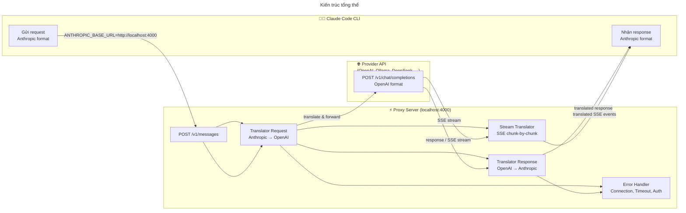
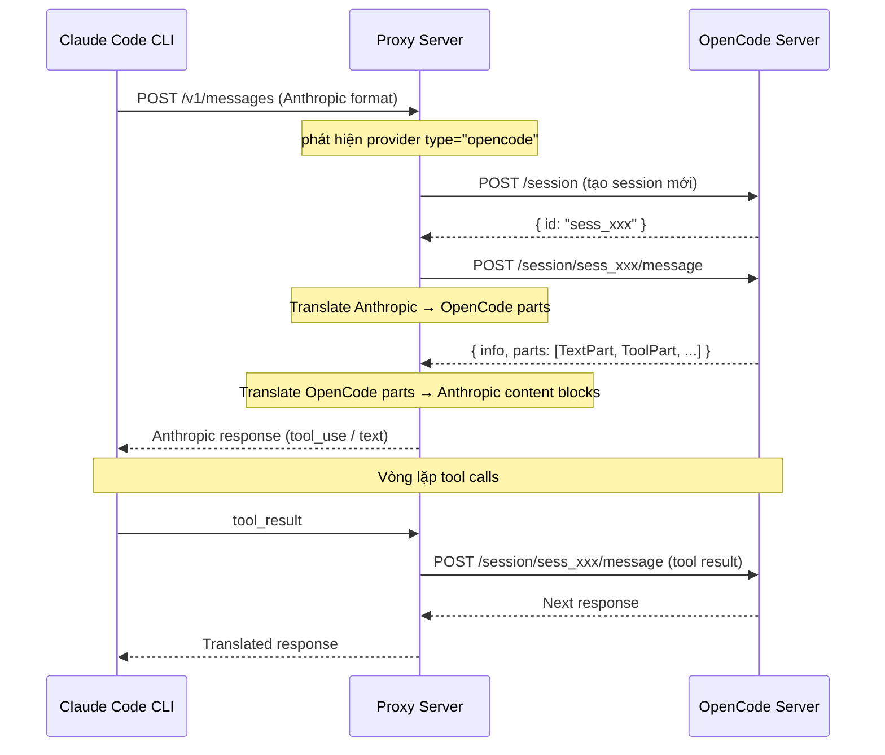

# Claude Code Free ✦

Dùng **Claude Code CLI** với **bất kỳ LLM provider nào** (OpenAI, Ollama, OmniRoute, DeepSeek, Azure, ...) thay vì Anthropic API.

## Cách hoạt động




Proxy **translate** định dạng API:
- **Anthropic Messages API** → **OpenAI Chat Completions API**
- Xử lý: system prompts, tool calls, streaming SSE, images, tool results
- **Tool calls** được buffer và translate chính xác giữa 2 format

## Quick Start

### 1. Cài đặt

```bash
git clone https://github.com/nbhson/claude-code-free.git
cd claude-code-proxy
npm install
```

### 2. Cấu hình

Copy và edit `config.json`:

```bash
cp config.json.example config.json
```

Nội dung cấu hình mẫu:

```json
{
  "port": 4000,
  "activeProvider": "openai",
  "providers": {
    "openai": {
      "baseUrl": "https://api.openai.com/v1",
      "apiKey": "sk-your-key-here",
      "model": "gpt-4o"
    },
    "ollama": {
      "baseUrl": "http://localhost:11434/v1",
      "apiKey": "",
      "model": "llama3.1:8b"
    }
  }
}
```

### 3. Chạy proxy

```bash
npm start
# hoặc
npm run dev  # auto-restart khi code thay đổi
```

### 4. Dùng với Claude Code CLI

```bash
ANTHROPIC_BASE_URL=http://localhost:4000 claude
```

> **Tất cả tính năng của Claude Code đều hoạt động** — file editing, bash commands, MCP tools, session management, v.v.

## Chuyển đổi Provider

### Cách 1: Config `activeProvider`

Sửa `activeProvider` trong `config.json`:

```json
{ "activeProvider": "ollama" }
```

### Cách 2: Biến môi trường

```bash
ACTIVE_PROVIDER=ollama npm start
```

### Cách 3: Env override (không cần sửa config)

```bash
PROVIDER_BASE_URL=http://localhost:11434/v1 \
PROVIDER_MODEL=llama3.1:8b \
PROVIDER_API_KEY= \
ACTIVE_PROVIDER=ollama \
ANTHROPIC_BASE_URL=http://localhost:4000 claude
```

### Cách 4: Header `X-Provider` (cho HTTP client)

```bash
curl http://localhost:4000/v1/messages \
  -H "Content-Type: application/json" \
  -H "X-Provider: deepseek" \
  -d '{"model":"deepseek-chat","messages":[{"role":"user","content":"Hello"}],"stream":false}'
```

## Cấu hình chi tiết

```jsonc
{
  "port": 4000,                   // Cổng proxy
  "activeProvider": "openai",     // Provider mặc định
  "providers": {
    "ten-provider": {
      "name": "Tên hiển thị",      // (tùy chọn)
      "baseUrl": "https://...",    // Base URL (OpenAI-compatible)
      "apiKey": "sk-...",          // API key (để trống nếu không cần)
      "model": "gpt-4o"           // Model name
    }
  }
}
```

## Providers tương thích

| Provider | Base URL | Tool Calling | Ghi chú |
|---|---|---|---|
| **OpenAI** | `https://api.openai.com/v1` | ✅ | Cần API key |
| **Ollama** | `http://localhost:11434/v1` | ⚠️ Model-dependent | Chạy local, free |
| **OmniRoute** | `http://localhost:8080/v1` | ✅ | Local AI Gateway |
| **DeepSeek** | `https://api.deepseek.com/v1` | ✅ | Rẻ |
| **Azure OpenAI** | `https://{res}.openai.azure.com/openai/deployments/{dep}` | ✅ | |
| **vLLM** | `http://localhost:8000/v1` | ✅ | Self-hosted |
| **Anyscale** | `https://api.endpoints.anyscale.com/v1` | ✅ | |
| **Together** | `https://api.together.xyz/v1` | ✅ | |
| **Mistral** | `https://api.mistral.ai/v1` | ✅ | |
| **Google Gemini (OpenAI proxy)** | `https://generativelanguage.googleapis.com/v1beta/openai` | ✅ | via Gemini OpenAI compatibility |

## OpenCode Integration 🆕

Proxy có thể dùng **OpenCode** (desktop AI coding assistant) làm backend provider thay vì gọi API trực tiếp.

### Cấu hình

```json
{
  "activeProvider": "opencode",
  "providers": {
    "opencode": {
      "type": "opencode",
      "baseUrl": "http://127.0.0.1:4096",
      "password": "your-password",
      "providerID": "openai",
      "modelID": "gpt-4o",
      "agent": "build"
    }
  }
}
```

| Field | Mô tả |
|---|---|
| `type` | `"opencode"` — bắt buộc để proxy biết dùng OpenCode handler |
| `baseUrl` | OpenCode server (mặc định `http://127.0.0.1:4096`) |
| `password` | `OPENCODE_SERVER_PASSWORD` nếu server có auth |
| `providerID` | Provider ID bên trong OpenCode (vd: `"openai"`, `"anthropic"`, `"ollama"`) |
| `modelID` | Model ID bên trong OpenCode (vd: `"gpt-4o"`, `"claude-sonnet-4-20250514"`) |
| `agent` | Agent type OpenCode sẽ dùng (`"build"`, `"plan"`, ...), optional |

### Luồng hoạt động



### Chú ý

- **OpenCode phải đang chạy** — `opencode serve`
- **Non-streaming**: v1 chỉ hỗ trợ non-streaming (sẽ bổ sung sau)
- **Session**: proxy auto-tạo và quản lý session, tự động xoá khi shutdown
- **Tool calls**: tool_use/tool_result được translate và cache ID mapping

## API

### `POST /v1/messages`

Anthropic Messages API → forward đến provider.

**Request** (Anthropic format):
```json
{
  "model": "claude-sonnet-4-20250514",
  "max_tokens": 1024,
  "system": "You are a helpful assistant.",
  "messages": [
    {"role": "user", "content": "List files in current directory"}
  ]
}
```

**Headers:**
- `X-Provider` — (optional) chọn provider (override `activeProvider`)
- `Content-Type: application/json`

### `GET /health`

Health check + provider info.

### `GET /providers`

Danh sách providers đã cấu hình.

## Hạn chế

1. **Extended Thinking**: Không hỗ trợ — Claude Code sẽ không dùng thinking với non-Claude models.
2. **Prompt Caching**: Không hỗ trợ — provider khác không có cache_control.
3. **Token counting**: Các provider báo số token khác nhau, số liệu có thể không chính xác tuyệt đối.
4. **Tool quality**: Tool calling phụ thuộc vào model đích. Model mạnh (GPT-4o, DeepSeek) hoạt động tốt; model nhỏ có thể gọi tool sai format.

## License

MIT
