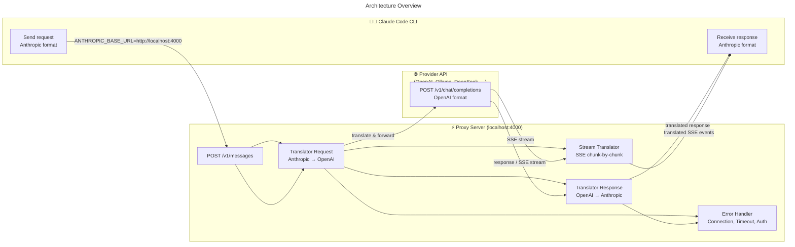
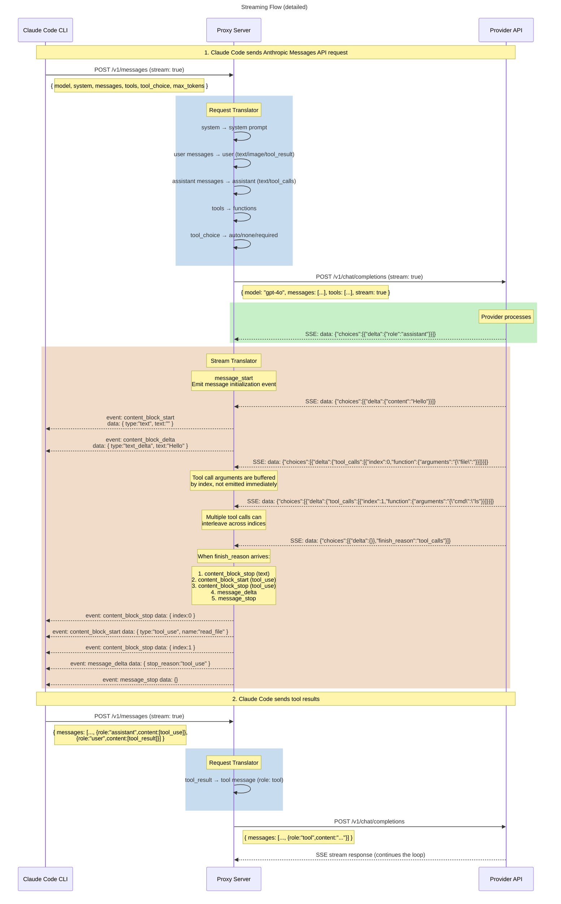
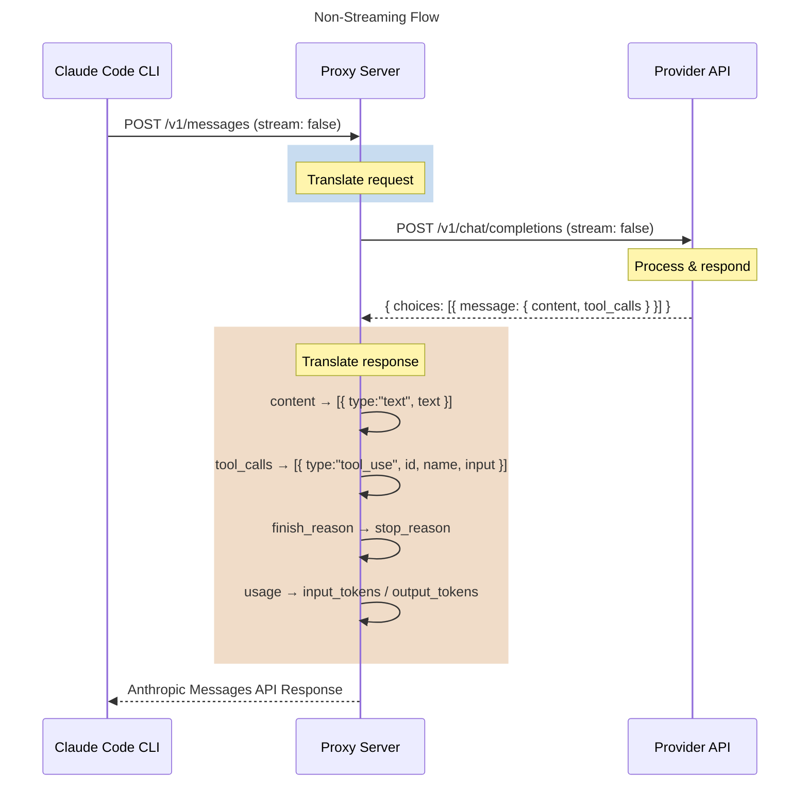

# Claude Code Proxy ✦

Use **Claude Code CLI** with **any LLM provider** (OpenAI, Ollama, OmniRoute, DeepSeek, Azure, ...) instead of the Anthropic API.

## How it works







The proxy **translates** between API formats:
- **Anthropic Messages API** → **OpenAI Chat Completions API**
- Handles: system prompts, tool calls, streaming SSE, images, tool results
- **Tool calls** are buffered and accurately translated between the two formats

## Quick Start

### 1. Install

```bash
git clone https://github.com/nbhson/claude-code-free.git
cd claude-code-proxy
npm install
```

### 2. Configure

Copy and edit `config.json`:

```bash
cp config.json.example config.json
```

Example configuration:

```json
{
  "port": 4000,
  "activeProvider": "openai",
  "providers": {
    "openai": {
      "baseUrl": "https://api.openai.com/v1",
      "apiKey": "sk-your-key-here",
      "model": "gpt-4o"
    },
    "ollama": {
      "baseUrl": "http://localhost:11434/v1",
      "apiKey": "",
      "model": "llama3.1:8b"
    }
  }
}
```

### 3. Start the proxy

```bash
npm start
# or
npm run dev  # auto-restart on code changes
```

### 4. Use with Claude Code CLI

```bash
ANTHROPIC_BASE_URL=http://localhost:4000 claude
```

> **All Claude Code features work** — file editing, bash commands, MCP tools, session management, etc.

> ⚠️ Newer Claude Code CLI versions require login. Run `/login` once, then use `ANTHROPIC_BASE_URL=http://localhost:4000 claude` — the proxy handles all requests without hitting the real Anthropic API.

### 5. Set up OpenCode Zen API (free)

Use **DeepSeek V4 Flash Free** or other free models via [OpenCode Zen](https://opencode.ai/zen):

1. Create an account at [opencode.ai/auth](https://opencode.ai/auth)
2. Copy your API key
3. Edit `config.json`:

```json
{
  "activeProvider": "opencode-zen",
  "providers": {
    "opencode-zen": {
      "name": "OpenCode Zen",
      "baseUrl": "https://opencode.ai/zen/v1",
      "apiKey": "sk-your-key-here",
      "model": "deepseek-v4-flash-free"
    }
  }
}
```

> Model IDs are just the name e.g. `deepseek-v4-flash-free`, no `opencode/` prefix.

Available free models:

| Model ID | Notes |
|---|---|
| `deepseek-v4-flash-free` | DeepSeek V4 Flash |
| `mimo-v2.5-free` | MiMo V2.5 |
| `big-pickle` | Big Pickle |
| `laguna-s-2.1-free` | Laguna S 2.1 |
| Other `*-free` models | See [Zen docs](https://opencode.ai/docs/zen/) |

Or use env overrides:

```bash
ACTIVE_PROVIDER=opencode-zen \
PROVIDER_BASE_URL=https://opencode.ai/zen/v1 \
PROVIDER_API_KEY=sk-your-key-here \
PROVIDER_MODEL=deepseek-v4-flash-free \
npm start
```

## Switching Providers

### Method 1: Config `activeProvider`

Edit `activeProvider` in `config.json`:

```json
{ "activeProvider": "ollama" }
```

### Method 2: Environment variable

```bash
ACTIVE_PROVIDER=ollama npm start
```

### Method 3: Env override (no config edit)

```bash
PROVIDER_BASE_URL=http://localhost:11434/v1 \
PROVIDER_MODEL=llama3.1:8b \
PROVIDER_API_KEY= \
ACTIVE_PROVIDER=ollama \
ANTHROPIC_BASE_URL=http://localhost:4000 claude
```

### Method 4: `X-Provider` header (for HTTP clients)

```bash
curl http://localhost:4000/v1/messages \
  -H "Content-Type: application/json" \
  -H "X-Provider: deepseek" \
  -d '{"model":"deepseek-chat","messages":[{"role":"user","content":"Hello"}],"stream":false}'
```

## Configuration details

```jsonc
{
  "port": 4000,                   // Proxy port
  "activeProvider": "openai",     // Default provider
  "providers": {
    "provider-name": {
      "name": "Display name",      // (optional)
      "baseUrl": "https://...",    // Base URL (OpenAI-compatible)
      "apiKey": "sk-...",          // API key (leave empty if not needed)
      "model": "gpt-4o"           // Model name
    }
  }
}
```

## Compatible Providers

| Provider | Base URL | Tool Calling | Notes |
|---|---|---|---|
| **OpenAI** | `https://api.openai.com/v1` | ✅ | API key required |
| **Ollama** | `http://localhost:11434/v1` | ⚠️ Model-dependent | Local, free |
| **OmniRoute** | `http://localhost:8080/v1` | ✅ | Local AI Gateway |
| **DeepSeek** | `https://api.deepseek.com/v1` | ✅ | Cheap |
| **Azure OpenAI** | `https://{res}.openai.azure.com/openai/deployments/{dep}` | ✅ | |
| **vLLM** | `http://localhost:8000/v1` | ✅ | Self-hosted |
| **Anyscale** | `https://api.endpoints.anyscale.com/v1` | ✅ | |
| **Together** | `https://api.together.xyz/v1` | ✅ | |
| **Mistral** | `https://api.mistral.ai/v1` | ✅ | |
| **Google Gemini (OpenAI proxy)** | `https://generativelanguage.googleapis.com/v1beta/openai` | ✅ | via Gemini OpenAI compatibility |
| **OpenCode Zen** 🆕 | `https://opencode.ai/zen/v1` | ✅ | Free models available (DeepSeek, MiMo, ...) |

## API

### `POST /v1/messages`

Anthropic Messages API → forward to provider.

**Request** (Anthropic format):
```json
{
  "model": "claude-sonnet-4-20250514",
  "max_tokens": 1024,
  "system": "You are a helpful assistant.",
  "messages": [
    {"role": "user", "content": "List files in current directory"}
  ]
}
```

**Headers:**
- `X-Provider` — (optional) select provider (overrides `activeProvider`)
- `Content-Type: application/json`

### `GET /health`

Health check + provider info.

### `GET /providers`

List configured providers.

## Limitations

1. **Extended Thinking**: Not supported — Claude Code won't use thinking with non-Claude models.
2. **Prompt Caching**: Not supported — other providers don't have cache_control.
3. **Token counting**: Different providers report different token counts, numbers may not be accurate.
4. **Tool quality**: Tool calling depends on the target model. Strong models (GPT-4o, DeepSeek) work well; smaller models may produce incorrect tool call formats.

## License

MIT
